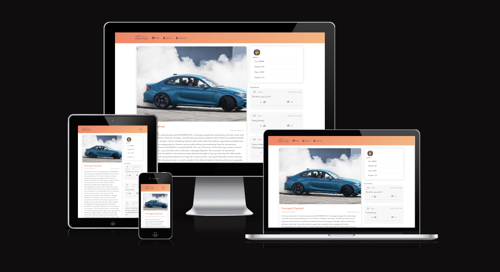
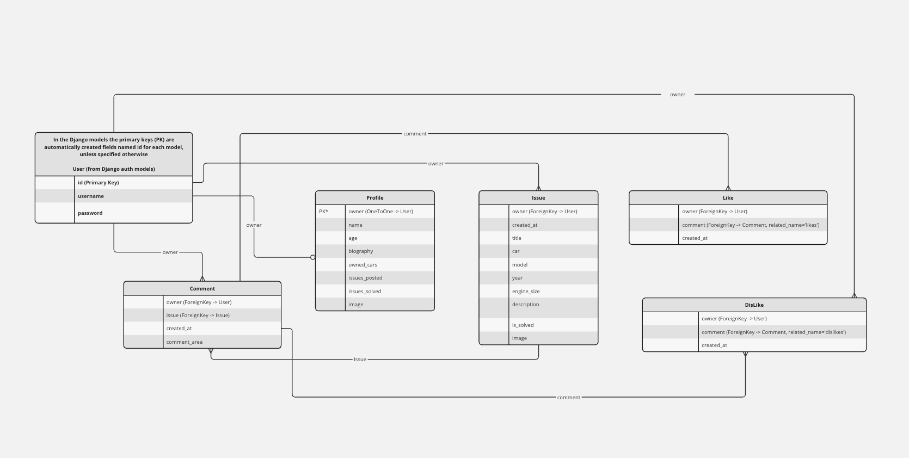
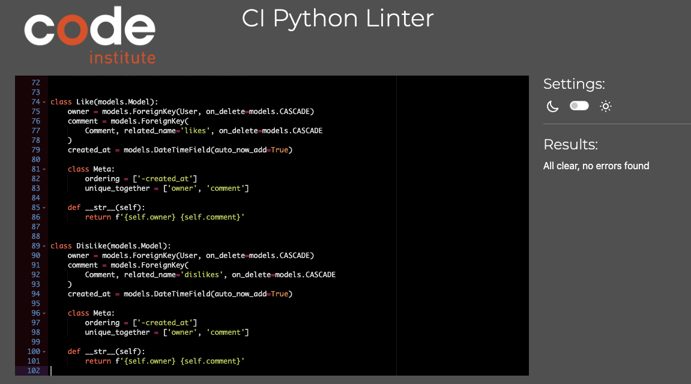
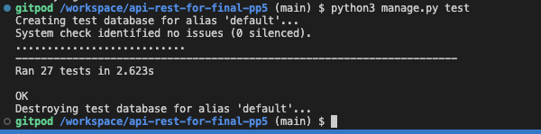

# Car Solution Army - Backend

[**CSA**](https://pp5-api-final-b2f167f1cdb6.herokuapp.com/) uses [Django Rest Framework](https://www.django-rest-framework.org) to serve as its API to interface with its frontend [React](https://www.npmjs.com) JavaScript library.

Car Solution Army (CSA) is a vibrant online community and blogging platform dedicated to troubleshooting car-related problems and issues. CSA serves as a gathering place for automotive enthusiasts, professionals, and everyday car owners seeking solutions to various vehicle challenges.

Members of CSA share their expertise, experiences, and insights to assist fellow community members in diagnosing and resolving car issues. The community covers a wide range of topics, including mechanical problems, electrical issues, maintenance tips, DIY repairs, and general troubleshooting advice. CSA provides a supportive environment where members collaborate, exchange ideas, and help one another navigate the complexities of car repairs and maintenance.

Whether it's a mysterious engine noise, a faulty electrical component, or advice on routine maintenance, CSA members come together to offer practical solutions and valuable guidance. The community fosters a sense of camaraderie, empowering car enthusiasts and owners with the knowledge and confidence to address car problems effectively.

CSA's blogging platform features detailed articles, how-to guides, and case studies contributed by experts and experienced community members. These resources serve as valuable references for individuals looking to understand, troubleshoot, and resolve specific car issues. By harnessing the collective knowledge of its members, CSA aims to make car ownership a more enjoyable and stress-free experience, ensuring that members can hit the road with confidence.

# 

- **[Click Here](https://pp5-react-3a1a7789b87e.herokuapp.com/)** to see the deployed frontend application
- **[Click Here](https://pp5-api-final-b2f167f1cdb6.herokuapp.com/)** to see the deployed backend API

- To view the frontend repository on Github **[Click Here](https://github.com/JacquesIversen/pp5-react)**.

- To view the back repository on Github **[Click Here](https://github.com/JacquesIversen/pp5-react)**.

## **Summary**

This backend application seek to fill a ordering and scaleable model based API to ensure futurious new editions adding multiple and interesting new features

## Contents

- [User Stories](#user-stories)
- [Entity Relationship Diagram](#entity-relationship-diagram)
- [Technologies](#technologies)
- [Testing](#testing)
- [Deployment](#deployment)
- [Credits](#credits)

### [User Stories](#user-stories)

**Navigation and authentication**

- Navigation: As a user, I can view a navbar from every page so that I can navigate easily between pages.
- Routing: As a user, I can navigate through pages quickly so that I can view content seamlessly without page refresh.
- Authentication - Sign up: As a user, I can create a new account so that I can access all the features for signed-up users.
- Authentication - Sign in: As a user, I can sign in to the app so that I can access functionality for logged-in users.
- Navigation: Conditional rendering - As a logged-out user, I can see sign-in and sign-up options so that I can sign in/sign up.
- Authentication - Logged in Status: As a user, I can tell if I am logged in or not so that I can log in if I need to.
- Authentication - Refreshing access tokens: As a user, I can maintain my logged-in status until I choose to log out so that my user experience is not compromised.

**Profile**

- Profile page: As a user, I can view other users' profiles so that I can see their posts and learn more about them.
- Profile page: As a user, I can view and edit information about myself for other to see.
- Profile page: As a user, I can see and follow my current activity on the site
- Profile page: As a user, I can see and follow others current activity on their site

**Commenting and liking**

- Create Issue: As a logged-in user, I can create issue with a single image.
- View an issue: As a user, I can view the details of a single issue
- Issuepage: As a user, I can view the Issue page so that I can read the comments/soulutions about the issue.
- Edit Issue: As an owner, I can edit all objects so that I can make corrections or update my issue after it was created.
- Create a comment: As a logged-in user, I can add comments to an issue so that I can share my thoughts about the issue.
- Comment date: As a user, I can see how long ago a comment was made so that I know how old a comment is.
- View comments: As a user, I can read comments on Issues so that I can read what other users might offer to solve it.
- Delete comments: As an owner of a comment, I can delete my comment so that I can control the removal of my comment from the application.
- Edit a comment: As an owner of a comment, I can edit my comment so that I can fix or update my existing comment.
- As a user I can

## [Entity Relationship Diagram](#entity-relationship-diagram)

# 

## [Technologies](#technologies)

### Django Rest Framework?

**1. Modularity and Scalability:**

- DRF encourages modular, reusable, and maintainable code. Add new features and editions without rewriting existing components, ensuring scalability for future enhancements.

**2. Authentication and Authorization:**

- Implement secure user authentication, login functionality, and secure access control for personalized user experiences. DRF offers various authentication methods, including token-based authentication.

**3. Data Handling with Serializers:**

- DRF's serializers simplify the conversion of complex data types into JSON. Seamlessly handle data related to car issues, solutions, user profiles, and comments.

**4. Model-View-Serializer (MVS) Architecture:**

- DRF's MVS architecture ensures clarity in code organization. Models represent database tables, serializers handle data conversion, and views process HTTP requests and responses.

**5. ORM and Database Models:**

- Leverage DRF's integration with Django's Object-Relational Mapping (ORM) system. Define database models for car issues, user profiles, comments, and more, enabling efficient CRUD operations.

**6. Pagination and Performance Optimization:**

- DRF supports pagination to manage high traffic efficiently. Implement query optimization techniques for enhanced performance, ensuring smooth user experiences.

**7. Third-Party Packages and Extensions:**

- DRF's extensive ecosystem offers third-party packages like Django REST Framework Throttle to prevent abuse and maintain fair API usage.

**8. Community and Documentation:**

- Benefit from DRF's active community, extensive documentation, tutorials, and support forums. Resolve issues, implement best practices, and explore advanced features with community support.

### Get Started

1. **Installation:**

   - Set up your virtual environment and install dependencies using `pip install -r requirements.txt`.

2. **Configuration:**

   - Configure your database settings in `settings.py`.
   - Set up authentication methods and permissions as per your project requirements.

3. **Models and Serializers:**

   - Define your database models for car issues, user profiles, comments, etc.
   - Create serializers to handle data conversion.

4. **Views and URLs:**

   - Implement views for API endpoints, handling HTTP requests and responses.
   - Configure URLs to map endpoints to views.

5. **Authentication and Authorization:**

   - Implement user authentication and authorization logic based on your community's requirements.

6. **Testing and Deployment:**

   - Write unit tests for your API endpoints.
   - Deploy your backend on your preferred hosting platform, ensuring security and scalability.

- #### Languages

  - [Python](<https://en.wikipedia.org/wiki/Python_(programming_language)>)

- #### Frameworks, Libraries, Programs and Services Used

  - [Django:](https://www.djangoproject.com/)

  - [Django Rest Frameworks](https://www.django-rest-framework.org/).

  - [Git:](https://git-scm.com/)

  - [GitHub:](https://github.com/)

  - [PostgreSQL:](https://www.postgresql.org/)

  - [ElephantSQL:](https://www.elephantsql.com/)

  - [Heroku:](https://heroku.com/)

### [Testing](#testing)

**Python Validation**

- Code Institute's CI Python Linter was used to validate all Python code.
- Only 9 total fileerrors to occur was Line Too Long, Expected x lines found x and newline at end of file. All errors were dealt with

## 

### Creating testcases in tests.py in Core for 27 test == Pass

- Note change of database in settings.py when doing so.

## 

- Testing with Get, Put, Post and Delete through postman, when testing endpoints. (**[Testfile](testing.md)**)

- Testing with Get, Put, Post and Delete through frontend application (DEV) == Pass (Testfile in frontend Repository)
- Testing with Get, Put, Post and Delete through frontend application (Production) == Pass (Testfile in frontend Repository)

### [Deployment](#deployment)

Creating a database using ElephantSQL was first required. The following steps were taken to do this:

- login to ElephantSQL.

- click 'Create new instance' on the dashboard.

- name the 'plan' and select the 'Tiny Turtle' option.

- select 'select region' and choose the nearest data centre to your location.

- click 'Review'.

- then go to the ElephantSQL dashboard and click on the 'database instance name' for this project.

- copy the ElephantSQL database URL to your clipboard.

- Return to the Heroku dashboard.

This project was deployed through Heroku using the following steps:

- Log into Heroku
- Select 'Create New App' from your dashboard
- Choose an app name
- Select the appropriate region based on your location
- Click 'Create App'

- On your dashboard, click the 'Deploy' tab
- Locate 'Deployment Method' and choose 'GitHub'
- locate your repository then click 'Connect'

- Click the 'Settings' tab
- Open the 'Config Vars' and click 'Reveal Config Vars'

- The following environment variables need to be added and match the same values in your env.py file:

  - CLIENT_ORIGIN
  - CLOUDINARY_URL
  - DATABASE_URL
  - DISABLE_COLLECTSTATIC
  - SECRET_KEY

- install psycopg2 and dj-database-urlth libraries to handle database connection.
- configured dj-rest-auth library for JWTs
- set allowed hosts
- configured CORS:

  - set allowed_origins

- gitignore the env.py file
- generate a requirements.txt file

once all the variables are in place, choose the main branch and click 'Deploy Branch'.
Once the build is finished, click 'Open App' located at the top of the page.

### [Credits](#credits)

This project came to life only with the help of numerous youtube tutorials and many, many shellcases resulted in a crash. Though were no special account, creator or video used for the basis of this project, but used for a broader understanding.

To name a few, but commonly used in this project

- CodingEntreprenuers
- Dennis Ivy (django + React Notes app)
- TechWithTim (Full stack web App Tutorial)

CI-drf-api walkthrough project.

A special thanks to my girlfriend for helping with the agile aspect of this:
