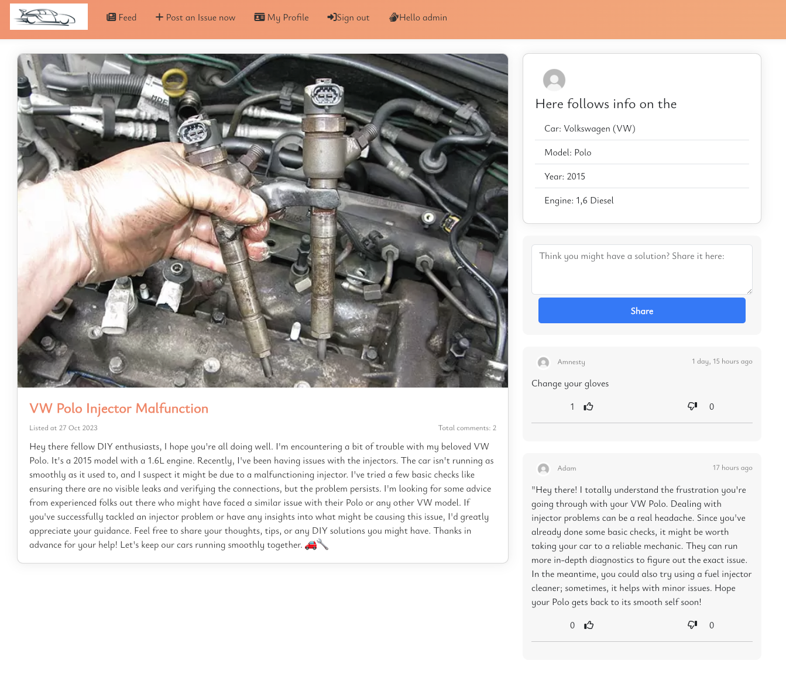

# Car Solution Army - Backend

# 

[**CSA**](https://pp5-api-final-b2f167f1cdb6.herokuapp.com/) uses [Django Rest Framework](https://www.django-rest-framework.org) to serve as its API to interface with its frontend [React](https://www.npmjs.com) JavaScript library.

Car Solution Army (CSA) is a vibrant online community and blogging platform dedicated to troubleshooting car-related problems and issues. CSA serves as a gathering place for automotive enthusiasts, professionals, and everyday car owners seeking solutions to various vehicle challenges.

Members of CSA share their expertise, experiences, and insights to assist fellow community members in diagnosing and resolving car issues. The community covers a wide range of topics, including mechanical problems, electrical issues, maintenance tips, DIY repairs, and general troubleshooting advice. CSA provides a supportive environment where members collaborate, exchange ideas, and help one another navigate the complexities of car repairs and maintenance.

Whether it's a mysterious engine noise, a faulty electrical component, or advice on routine maintenance, CSA members come together to offer practical solutions and valuable guidance. The community fosters a sense of camaraderie, empowering car enthusiasts and owners with the knowledge and confidence to address car problems effectively.

CSA's blogging platform features detailed articles, how-to guides, and case studies contributed by experts and experienced community members. These resources serve as valuable references for individuals looking to understand, troubleshoot, and resolve specific car issues. By harnessing the collective knowledge of its members, CSA aims to make car ownership a more enjoyable and stress-free experience, ensuring that members can hit the road with confidence.

- **[Click Here](https://pp5-react-3a1a7789b87e.herokuapp.com/)** to see the deployed website.

- To view the frontend repository on Github **[Click Here](https://github.com/JacquesIversen/pp5-react)**.

## **Summary**

This backend application seek to fill a ordering and scaleable model based API to ensure futurious new editions adding multiple and interesting new features

## Contents

- [User Stories](#user-stories)
- [Entity Relationship Diagram](#entity-relationship-diagram)
- [Technologies](#technologies)
- [Testing](#testing)
- [Deployment](#deployment)
- [Credits](#credits)

### [Technologies](#technologies)

### Django Rest Framework?

**1. Modularity and Scalability:**

- DRF encourages modular, reusable, and maintainable code. Add new features and editions without rewriting existing components, ensuring scalability for future enhancements.

**2. Authentication and Authorization:**

- Implement secure user authentication, login functionality, and secure access control for personalized user experiences. DRF offers various authentication methods, including token-based authentication.

**3. Data Handling with Serializers:**

- DRF's serializers simplify the conversion of complex data types into JSON. Seamlessly handle data related to car issues, solutions, user profiles, and comments.

**4. Model-View-Serializer (MVS) Architecture:**

- DRF's MVS architecture ensures clarity in code organization. Models represent database tables, serializers handle data conversion, and views process HTTP requests and responses.

**5. ORM and Database Models:**

- Leverage DRF's integration with Django's Object-Relational Mapping (ORM) system. Define database models for car issues, user profiles, comments, and more, enabling efficient CRUD operations.

**6. Pagination and Performance Optimization:**

- DRF supports pagination to manage high traffic efficiently. Implement query optimization techniques for enhanced performance, ensuring smooth user experiences.

**7. Third-Party Packages and Extensions:**

- DRF's extensive ecosystem offers third-party packages like Django REST Framework Throttle to prevent abuse and maintain fair API usage.

**8. Community and Documentation:**

- Benefit from DRF's active community, extensive documentation, tutorials, and support forums. Resolve issues, implement best practices, and explore advanced features with community support.

### Get Started

1. **Installation:**

   - Clone this repository.
   - Set up your virtual environment and install dependencies using `pip install -r requirements.txt`.

2. **Configuration:**

   - Configure your database settings in `settings.py`.
   - Set up authentication methods and permissions as per your project requirements.

3. **Models and Serializers:**

   - Define your database models for car issues, user profiles, comments, etc.
   - Create serializers to handle data conversion.

4. **Views and URLs:**

   - Implement views for API endpoints, handling HTTP requests and responses.
   - Configure URLs to map endpoints to views.

5. **Authentication and Authorization:**

   - Implement user authentication and authorization logic based on your community's requirements.

6. **Testing and Deployment:**

   - Write unit tests for your API endpoints.
   - Deploy your backend on your preferred hosting platform, ensuring security and scalability.

7. **Contribute:**
   - Join our open-source community! Contribute to the project by fixing bugs, adding new features, or improving documentation.

Thank you for choosing Django Rest Framework for your car blogging community! If you have questions or need assistance, don't hesitate to reach out to our community forums. Happy coding! 🚗💻

- #### Languages

  - [Python](<https://en.wikipedia.org/wiki/Python_(programming_language)>)

- #### Frameworks, Libraries, Programs and Services Used

  - [Django:](https://www.djangoproject.com/)

  - [Django Rest Frameworks](https://www.django-rest-framework.org/).

  - [Git:](https://git-scm.com/)

  - [GitHub:](https://github.com/)

  - [PostgreSQL:](https://www.postgresql.org/)

  - [ElephantSQL:](https://www.elephantsql.com/)

  - [Heroku:](https://heroku.com/)

### [Testing](#testing)

Comprehensive manual testing was carried out to guarantee that Users without the necessary permissions would not have Write Access.
It was a fundamental priority to restrict Users from having the ability to create, update, or delete data; or perform actions that could jeopardize sensitive data; or modify the system's state through adding new records, editing existing content, or making changes to configuration settings.

Create, Read, Update and Delete (CRUD) functionality across this API was tested manually. This ensured that the database and handling of data worked as expected when Users manipulated data on the frontend React app.
All apps passed the tests conducted for verifying the intended backend functionality. For more details on each test visit the **testing.md** file found **[here](/testing.md)**.

Backend manual testing used throughout each stage of development helped guarantee that the acceptance criteria set out in each of the User Stories was achieved. These User Stories can be found **[here](https://github.com/users/SamOBrienOlinger/projects/3)** in Github Projects.

For further details of testing carried out on the React frontend relevant to verifying the backend functionality, please visit the **[frontend repository README.md file](https://github.com/SamOBrienOlinger/spoodle-space-pp5/blob/main/README.md)** and **[frontend repository testing.md file](https://github.com/SamOBrienOlinger/spoodle-space-pp5/blob/main/testing.md)**.

**Python Validation**

Code Institute's CI Python Linter was used to validate all Python code. Every app passed without errors, except for E501 'line too long' warnings, an example of this can be seen below:

**Fixed Bugs**

Migrated changes to models.py files caused the most problems overall. Although the data did exist in the [database](https://www.elephantsql.com/), the database was corrupted and had to be delete entirely.
A new instance needed to be created and connected to the API. The env.py file and Heroku Config Vars were updated accordingly. The important learning from idenitifying the cause and then the solution to this problem was understanding that the issue was caused by a migration that altered a model -from having an owner = ForeignKey when a OneToOneField was required instead.

### [Deployment](#deployment)

Creating a database using ElephantSQL was first required. The following steps were taken to do this:

- login to ElephantSQL.

- click 'Create new instance' on the dashboard.

- name the 'plan' and select the 'Tiny Turtle' option.

- select 'select region' and choose the nearest data centre to your location.

- click 'Review'.

- then go to the ElephantSQL dashboard and click on the 'database instance name' for this project.

- copy the ElephantSQL database URL to your clipboard.

- Return to the Heroku dashboard.

This project was deployed through Heroku using the following steps:

- Log into Heroku
- Select 'Create New App' from your dashboard
- Choose an app name
- Select the appropriate region based on your location
- Click 'Create App'

- On your dashboard, click the 'Deploy' tab
- Locate 'Deployment Method' and choose 'GitHub'
- locate your repository then click 'Connect'

- Click the 'Settings' tab
- Open the 'Config Vars' and click 'Reveal Config Vars'

- The following environment variables need to be added and match the same values in your env.py file:

  - CLIENT_ORIGIN
  - CLOUDINARY_URL
  - DATABASE_URL
  - DISABLE_COLLECTSTATIC
  - SECRET_KEY

- install psycopg2 and dj-database-urlth libraries to handle database connection.
- configured dj-rest-auth library for JWTs
- set allowed hosts
- configured CORS:

  - set allowed_origins

- gitignore the env.py file
- generate a requirements.txt file

once all the variables are in place, choose the main branch and click 'Deploy Branch'.
Once the build is finished, click 'Open App' located at the top of the page.

### [Credits](#credits)
