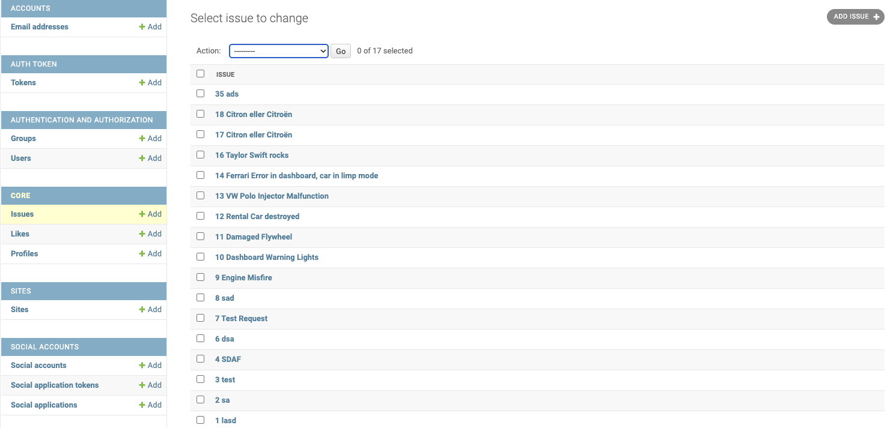
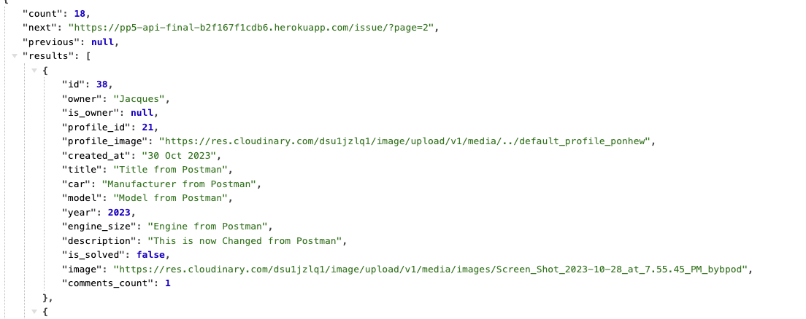

## Manuel User Authentication Test Cases

### Test Case 1: UserAuth

**Test Case Description:** Verify that user can create user and login with user
Following is tested in django/rest/admin & Postman
See frontend repository for dev & deployed version
Pass will only be achieved when data is displayed in Api.

**Test Steps from admin panel:**

1. Admin can add/create a user/profiles == Pass
2. Admin can edit & delete a user/profiles == Pass
3. Admin has CRUD function to an Issue == Pass
4. Admin has CRUD function to Likes from all users == Pass
5. Admin has CRUD function to comments from all users == Pass

**Expected Result:**
Data should be stored in api without errors or corrupted data.

**Result:** Passed

## 

**Test Issue, comment and like from Postman**

- Using Mathias & Jacques as users with username, password and accesstoken/bearertoken plugged into query params in postman:
- Testing creating an Issue in Postman.

- Issue

1. Get user credentials, username & password == pass
2. Console.log access token in application, and plug into key param == pass
3. Get Issue == pass
4. Post Issue == fail
5. Input Issue tablemodels with content (x from postman) and post == pass
6. Ability to edit/put == pass
7. Ability to delete == pass

## 

## Change from postman in description

## 

- Comment

1. Get user credentials, username & password == pass
2. Console.log access token in application, and plug into key param == pass
3. Get comment (get Issue Id)== pass
4. Post comment == fail
5. Input comment tablemodels with content (x from postman) and post == pass
6. Ability to edit/put == pass
7. Ability to delete == pass

## 

- Like

1. Get user credentials, username & password == pass
2. Console.log access token in application, and plug into key param == pass
3. Get like (get comment Id)== pass
4. Post Like == fail
5. Input comment tablemodels with content (x from postman) and post == pass
6. Ability to delete == pass

- DisLike

1. Get user credentials, username & password == pass
2. Console.log access token in application, and plug into key param == pass
3. Get disLike (get comment Id)== pass
4. Post disLike == fail
5. Input comment tablemodels with content (x from postman) and post == pass
6. Ability to delete == pass

**Expected Result:**
API need bearer token, when supplied will allow for CRUD.
All Actions allow correct movement and activity in APi.

**Result:** Passed
